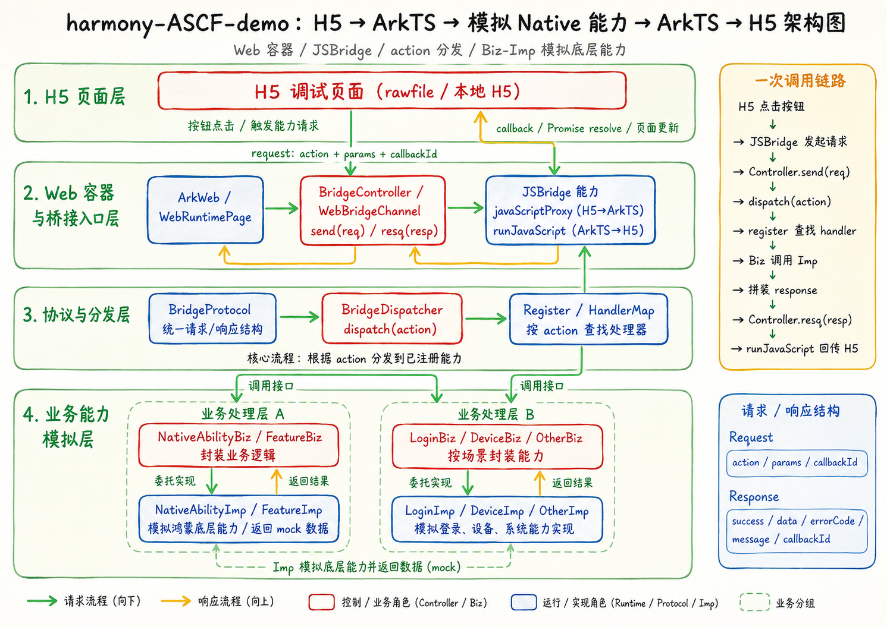

# harmony-ASCF-demo
> 一个用于学习 HarmonyOS **ASCF / 元服务 / Web 容器 / JSBridge** 的 Demo 工程。

## 项目简介

这是一个用于学习 HarmonyOS ASCF（Atomic Service Composition Framework）/ 元服务 / Web 容器 / JSBridge 的 Demo，重点演示**小程序式 Web 容器**、**Native 能力桥接**、**网络调试**和**实时通信链路**。

它不是一个业务产品，而是把一组关键技术点串成一条「看得见、点得动、能讲清楚」的完整链路：

```
H5 → ArkTS → 模拟 Native 能力 → ArkTS → H5
```

整个工程坚持清晰的分层，方便新人逐层阅读：

```
UI / Component → Controller → Biz → Imp → Http / Bridge / Common
```

## 核心功能

- **ASCF 元服务能力看板**：首页一屏看懂工程包含哪些能力
- **HMRouter 页面导航**：导航宿主 + 声明式路由，Tab 内跳转详情页 / Web 容器页
- **Web 容器加载本地 H5**：ArkWeb 加载 `rawfile` 下的 H5 页面
- **JSBridge 双向通信**：`javaScriptProxy`（H5→ArkTS）+ `runJavaScript`（ArkTS→H5）
- **Native 能力模拟分发**：Bridge 层按 `action` 把请求分发到模拟底座能力
- **白名单拦截与 Web 容器治理**：加载进度 / 标题 / 资源错误 / HTTP 错误 / 白名单拦截
- **网络调试悬浮窗**：全局悬浮球，记录 REST 请求与 WebSocket 帧
- **REST 请求示例**：GET / POST / DELETE 管理待办
- **WebSocket 实时通信**：长连接接收在线人数、seq、echo 消息
- **多模块结构**：entry（HAP）+ common（HAR）+ library（HSP），含动态 / 延迟加载

## 项目结构

```
MyApplication2/
├── entry/                      # 主模块（HAP）
│   └── src/main/ets/
│       ├── pages/              # Index(导航宿主) / MainPage(Tab 分栏) / DetailPage / WebRuntimePage
│       ├── components/         # HomeTab / DiscoverTab / TodoTab / MineTab / LazyLoadCard
│       │   └── common/         # 通用 UI 组件：SectionHeader / FeatureCard / StatusPill / MetricCard
│       ├── controller/         # DiscoverController / TodoController / LiveController
│       ├── biz/                # AscfFeatureBiz / TodoBiz / LiveBiz（extends BaseBiz）
│       ├── imp/                # AscfFeatureImp / TodoImp / LiveImp（对接数据源）
│       ├── model/              # AscfFeature / Todo / WsEvent（领域模型）
│       ├── viewmodel/          # DiscoverViewModel / TodoViewModel / LiveViewModel（@ObservedV2/@Trace）
│       ├── bridge/             # JSBridge：协议 / 通道 / 分发 / 模拟底座能力
│       ├── debug/              # NetMonitorPanel：网络调试悬浮窗
│       ├── constants/          # RouterConstants：同模块路由常量
│       └── lazydemo/           # 动态加载 vs 延迟加载示例
├── common/                     # HAR 静态共享库：HttpUtil / WsClient / ApiResponse / NetMonitor / ApiConstants
├── library/                    # HSP 动态共享库：动态 import 目标
└── docs/                       # 学习文档（8 篇）
```

## ASCF 主链路架构图


## 演示路径（3 分钟路线）

1. **首页看能力地图** —— 打开 App，首页是「ASCF 元服务能力工作台」，看清工程包含哪些能力
2. **打开 Web 容器** —— 点击进入 `WebRuntimePage`（JSBridge 调试实验室）
3. **点击 H5 按钮** —— 在内嵌 H5 页面里点按钮，触发 `H5 → ArkTS` 的桥接调用
4. **查看 BridgeLog** —— 页面下方桥接日志实时显示 action / 请求 / 响应 / 状态
5. **打开 NetMonitor** —— 点右下角悬浮球，打开全局网络调试面板
6. **切到实时任务页连接 WebSocket** —— 进「实时任务协作」Tab，点「连接」建立长连接
7. **查看请求和实时帧** —— 在 NetMonitor 里同时看到 REST 请求与 WebSocket 帧

## 技术亮点

- **ArkUI V2 状态驱动**：`@ComponentV2` / `@Local` / `@ObservedV2` / `@Trace`，响应式刷新
- **HMRouter 路由**：`HMNavigation` 导航宿主 + `@HMRouter` 声明式页面 + `push/pop`
- **ASCF 元服务接入**：`ascf-toolkit` hvigor 插件 + `@atomicservice/ascfapi` 运行时能力
- **多模块架构**：entry（HAP）+ common（HAR 静态共享）+ library（HSP 动态共享），演示 `import()` 动态加载与 `import lazy` 延迟加载
- **分层架构**：UI → Controller → Biz → Imp → Http / Bridge，关注点分离
- **ArkWeb Web 容器**：标准 `Web` 组件 + `javaScriptProxy` / `runJavaScript` 双向桥
- **容器治理**：加载进度 / 标题 / `onErrorReceive` / `onHttpErrorReceive` / `onLoadIntercept` 白名单
- **网络调试链路**：HttpUtil / WsClient 埋钩子，悬浮面板记录 REST 与 WS 帧
- **实时通信**：WebSocket 长连接 + REST（GET / POST / DELETE）在业务页面里协同

## 本地运行方式

1. 用 **DevEco Studio**（建议 5.x，API 18+）打开本工程
2. 等待 `ohpm install` / Sync 完成（`file:` 依赖需要先 Sync 进 `oh_modules`）
3. 连接元服务模拟器或真机，选择 `entry` 模块 Run
4. **网络相关功能（待办 / 实时通道）需要配套后端**：在 `common` 的 `ApiConstants` 里配置 `BASE_URL` / `WS_URL`，指向本地 Node/Next 服务；
   不配后端也能正常运行 UI，只是网络调用会走「加载失败」兜底

> 提示：`ascf-toolkit` 插件会打印 `ascf/ascf_src/app.json is not exist`、ArkTS linter 会对 `@HMRouter` 报 `invalid decorator`，这两个都是**非致命告警**，照样 `BUILD SUCCESSFUL`。

## docs 学习文档列表

| # | 文档 | 主题 |
|---|---|---|
| 1 | [webSocket 与 SSE 区别](docs/1-webSocket与SSE区别.md) | 两种实时通信方案对比 |
| 2 | [动态加载以及延迟加载](docs/2-动态加载以及延迟加载.md) | `import()` 与 `import lazy` |
| 3 | [HAP, HSP, HAR 区别以及导入概念](docs/3-HAP,HSP,HAR区别以及导入概念.md) | 多模块类型与单例差异 |
| 4 | [鸿蒙 Web 容器 - 把 H5 嵌进鸿蒙页面](docs/4-鸿蒙Web容器-把H5嵌进鸿蒙页面.md) | ArkWeb 加载本地 H5 |
| 5 | [JSBridge 通信协议 - 先把消息格式定下来](docs/5-JSBridge通信协议-先把消息格式定下来.md) | Bridge 协议设计 |
| 6 | [JSBridge 上半场 - H5 怎么调到 ArkTS](docs/6-JSBridge上半场-H5怎么调到ArkTS.md) | `javaScriptProxy` |
| 7 | [JSBridge 分发层 - 按 action 找到底座能力](docs/7-JSBridge分发层-按action找到底座能力.md) | Dispatcher 分发 |
| 8 | [JSBridge 闭环与容器治理](docs/8-JSBridge闭环与容器治理-兼谈AtomicServiceEnhancedWeb.md) | `runJavaScript` 回传 + 治理 |

## JSBridge 协议升级与 Native 能力注册中心

这一节记录把 JSBridge 从「能通信」升级到「更像真实小程序底座」做了什么、为什么这么做。

### 为什么需要 requestId

H5 调 `window.ascfBridge.send(req)` 是「发出去就返回」的，真正的结果是 ArkTS 处理完之后，再通过 `runJavaScript` **异步**回调 H5 的。一来一回是两次独立的调用，所以必须给每次请求生成一个唯一 `id`，响应里带回同一个 `id`，H5 才能把「这条响应」配回「那次调用」。

### 为什么需要 callback 管理

H5 侧用一张 `pending` 表（`id → { resolve, reject, timer }`）保存每次调用的回调。ArkTS 回传时，`window.__ascfOnResponse` 按 `id` 在表里找回对应回调并 resolve / reject；找不到（比如已超时被清理）就打一条日志，不会静默丢弃。

### 为什么需要 timeout

如果 ArkTS 因为异常没有回调，H5 的回调会永远挂着。所以每次调用都挂一个定时器（默认 5000ms），到点还没收到响应就按 `408 TIMEOUT` 主动 reject，并清掉 pending。H5 SDK 封装成：

```js
ascf.call('getLocation', {}, { timeout: 3000 })
  .then(resp => { /* resp.data */ })
  .catch(resp => { /* resp.code === 408 即超时 */ });
```

### 为什么把 action 分发改成 registry

原来 `BridgeDispatcher` 用一长串 `if (action === 'xxx')` 分发，加一个能力就要改主流程。现在引入 `NativeAbilityRegistry`（`register / has / dispatch`），把 `action → handler` 存进一张表：

- `NativeAbilityBiz.registerTo(registry)` 负责声明「我提供哪些能力」；
- `BridgeDispatcher.dispatch` 只剩一行 `return registry.dispatch(req)`；
- 以后新增能力只需 `register` 一个 handler，不动分发主流程。

统一错误码：`OK=0 / BAD_REQUEST=400 / TIMEOUT=408 / UNKNOWN_ACTION=404 / INTERNAL_ERROR=500`。缺 id/action、未知 action、handler 抛异常，都会回标准 `BridgeResponse`，不会静默失败。

### 新增了哪些模拟 Native 能力

| action | 说明 | 实现 |
|---|---|---|
| `getDeviceInfo` | 设备品牌 / 型号 / 系统版本 | 真实读 `deviceInfo` |
| `getCurrentTime` | 当前时间戳 / 本地时间 | 真实 `Date` |
| `openToast` | 弹鸿蒙原生 Toast | 页面 `UIContext` |
| `setClipboardData` | 写剪贴板 | 内存 mock（注释含真机 `pasteboard` 写法）|
| `getClipboardData` | 读剪贴板 | 内存 mock |
| `getLocation` | 获取定位 | 固定模拟坐标（`source: mock`）|

> 剪贴板默认走内存 mock，是为了「在任何环境都能编译、可演示」；真机接入改用 `@kit.BasicServicesKit` 的 `pasteboard` 同步 API 即可（代码注释里给了写法）。定位为模拟数据，不申请定位权限。

### 完整调用流程

```text
H5  ascf.call(action, params)            // 生成 requestId，挂 timeout，存 pending
→  window.ascfBridge.send(JSON)          // H5 → ArkTS（javaScriptProxy 注入的 send）
→  WebBridgeChannel.send                 // 解析 + 校验（缺字段回 BAD_REQUEST，不静默）
→  BridgeDispatcher.dispatch
→  NativeAbilityRegistry.dispatch        // 按 action 查表
→  NativeAbilityBiz / NativeAbilityImp   // 执行模拟底座能力
→  组装 BridgeResponse + BridgeLog 记录
→  controller.runJavaScript              // ArkTS → H5（setTimeout(0) 下一拍，避免重入）
→  window.__ascfOnResponse(json)         // 按 id 找回 pending 的回调
→  resolve / reject                      // 更新「最近结果 / 状态 / 日志」
```

### 真机 / 模拟器验证方式

1. DevEco Studio 打开工程，连元服务模拟器或真机，Run `entry`。
2. 首页 →「打开 Web 容器」进入 **JSBridge 调试实验室**。
3. 逐个点 H5 按钮：
   - 获取设备信息 / 当前时间 → 「最近结果」返回真实数据，状态变「成功」；
   - 弹 Toast → 鸿蒙原生 Toast 弹出；
   - 写入剪贴板 → 再点读取剪贴板，应读回刚写入的文本；
   - 获取模拟定位 → 返回 Hong Kong 模拟坐标；
   - 调用未知能力 → 状态变「失败」，结果显示 `[404] 未知 action`（演示统一错误）。
4. 看页面下方 **桥接日志**：每条都有 action / 状态 / id / 请求 / 响应。
5. 点右下角悬浮球打开 **NetMonitor**，可一并查看网络调用。

## 后续计划

- [x] 模拟 Native 能力：剪贴板、定位（已接入）
- [x] 桥接协议升级：requestId / 统一错误码 / H5 超时 / 能力注册中心（已接入）
- [ ] 更多模拟 Native 能力（扫码 / 支付 / 分享）
- [ ] 桥接超时的 ArkTS 侧 pending 队列 + 重试
- [ ] Web 容器预加载与多实例治理
- [ ] 主题系统与暗色模式
- [ ] 为 Biz / Imp 层补单元测试
